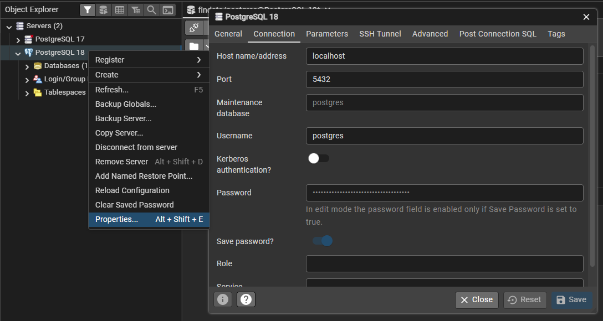
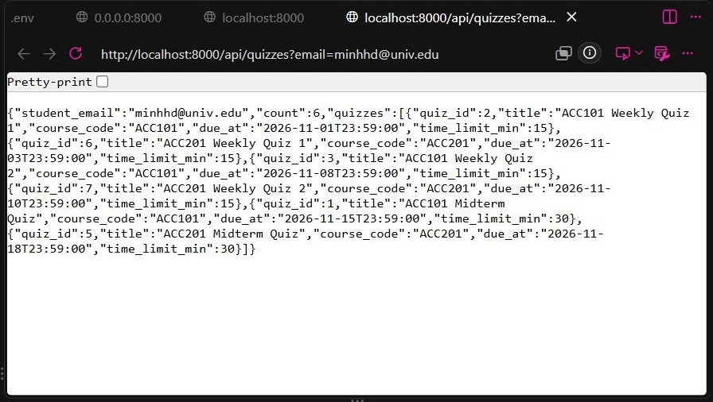

# Mini-LMS — Setup Guide

This guide takes a **brand-new machine** from zero to a running Mini-LMS API that returns real data from PostgreSQL. Follow it top to bottom; do not skip steps.

**Time to complete:** about 8–15 minutes on a fresh machine.

---

## 1. Prerequisites

Install these before continuing. Versions matter.

| Tool | Minimum version | Download |
|---|---|---|
| Git | 2.40 | <https://git-scm.com/downloads> |
| Python | 3.11 | <https://www.python.org/downloads/> |
| PostgreSQL | 17 | <https://www.enterprisedb.com/downloads/postgres-postgresql-downloads> |
|pgAdmin 4 (Optional) | 9.15 | <https://www.pgadmin.org/> |

### 1.1 Installing Homebrew (macOS only)

If you are on macOS and do not already have Homebrew, install it first. This is the package manager that provides `postgresql@18` in the next step.

```bash
/bin/bash -c "$(curl -fsSL https://raw.githubusercontent.com/Homebrew/install/HEAD/install.sh)"
```

After installation, Homebrew prints **two commands** at the end of its output, telling you how to add `brew` to your shell. Run them. They look like one of these:

**Apple Silicon (M1 / M2 / M3 / M4):**
```bash
echo 'eval "$(/opt/homebrew/bin/brew shellenv)"' >> ~/.zprofile
eval "$(/opt/homebrew/bin/brew shellenv)"
```

**Intel Mac:**
```bash
echo 'eval "$(/usr/local/bin/brew shellenv)"' >> ~/.zprofile
eval "$(/usr/local/bin/brew shellenv)"
```

Confirm Homebrew works:

```bash
brew --version
```

You should see something like `Homebrew 4.x.x`.

### 1.2 Installing PostgreSQL

**Windows** — download the installer from [here](https://www.enterprisedb.com/downloads/postgres-postgresql-downloads) and run the wizard.
- Set the `postgres` superuser password to `postgres` for this course (or your customized username & password).
- Keep the default port `5432` (or your customized port).
- The Windows service in `services.msc` is created as `postgresql-x64-18`.
- **After installation, open a new terminal** so `psql` is on PATH.

**macOS (Homebrew):**
```bash
brew install postgresql@17
brew services start postgresql@17

# Homebrew does not symlink versioned formulas onto PATH by default:
echo 'export PATH="/opt/homebrew/opt/postgresql@17/bin:$PATH"' >> ~/.zshrc
# Intel Mac: use /usr/local/opt/postgresql@18/bin instead of /opt/homebrew/...
exec zsh
```
Homebrew creates a superuser matching your macOS username with **no password**.

**Linux (Ubuntu / Debian):**
```bash
sudo sh -c 'echo "deb https://apt.postgresql.org/pub/repos/apt $(lsb_release -cs)-pgdg main" > /etc/apt/sources.list.d/pgdg.list'
wget --quiet -O - https://www.postgresql.org/media/keys/ACCC4CF8.asc | sudo apt-key add -
sudo apt update
sudo apt install -y postgresql-17
sudo systemctl start postgresql
sudo -u postgres psql -c "ALTER USER postgres PASSWORD 'postgres';"
```

Confirm the database server is reachable. You may be prompted for the password you just set (Windows / Linux) — on macOS Homebrew there is no password, so press Enter or it will connect straight away:

```bash
psql -U postgres -h localhost -c "SELECT version();"
```

You should see a line starting with `PostgreSQL 17.x`.

---

## 2. Clone and install

```bash
git clone https://github.com/SE-FDA-NEU-AI66B/AI66B-G3-D3-Mini-LMS.git
cd AI66B-G3-D3-Mini-LMS
```

Then create and activate a virtual environment.

**macOS / Linux:**
```bash
python -m venv .venv
source .venv/bin/activate
```

**Windows (PowerShell):**
```powershell
python -m venv .venv
.venv\Scripts\Activate.ps1
```

> **Windows: `Activate.ps1 cannot be loaded because running scripts is disabled`.**
> PowerShell's default execution policy blocks the activation script. Run this once:
> ```powershell
> Set-ExecutionPolicy -Scope CurrentUser -ExecutionPolicy RemoteSigned
> ```
> Answer `Y`, then re-run `.venv\Scripts\Activate.ps1`.

Install dependencies.

```bash
pip install -r requirements.txt
```

You should now see `(.venv)` at the start of your shell prompt.

---

## 3. Configure the environment

Copy the example env file.

**macOS / Linux:**
```bash
cp .env.example .env
```

**Windows:**
```powershell
copy .env.example .env
```

Your `.env.example` should look like this. Open `.env` and adjust the database credentials to match your machine.

```dotenv
DB_HOST=localhost
DB_PORT=5432
DB_NAME=your-db-name  # default: postgres
DB_USER=your-db-user  # default: postgres
DB_PASSWORD=your-password
SESSION_SECRET=change-me
SSO_MOCK_BASE_URL=http://localhost:8000/mock-sso
```

If your machine has pgAdmin 4 installed, this is where you can your local database properties



Use this table to pick the right `DB_USER` / `DB_PASSWORD` for your OS:

| OS | `DB_USER` | `DB_PASSWORD` |
|---|---|---|
| Windows | `postgres` | the password you set during install (default `postgres`) |
| macOS (Homebrew) | *your macOS username* | *(leave blank)* |
| Linux (apt) | `postgres` | `postgres` |

> **`SESSION_SECRET`** — used to sign session cookies. `change-me` is fine for this course; change it to a random string in any real deployment.
> **`SSO_MOCK_BASE_URL`** — placeholder for a future mock SSO. The current code has a default, so this key can be left as-is.

Never commit `.env`. The repository's `.gitignore` already excludes it — verify with:

```bash
git check-ignore -v .env
```

You should see a line containing `.gitignore:.env` (or similar).

---

## 4. Create and seed the database

One command creates the `postgres` database (if missing), applies `db/schema.sql.txt`, and loads `db/seed.sql.txt`.

```bash
python db/init_db.py
```

Expected output on the **first** run:

```
Target: postgres@localhost:5432/postgres

Database 'postgres' not found — creating it ...
Running schema and seed ...
  → db/schema.sql.txt
  → db/seed.sql.txt

Database initialised.
  users       : 13
  courses     : 3
  enrollments : 20
  quizzes     : 12
  questions   : 48
  options     : 96
  attempts    : 2
  answers     : 8
```

On subsequent runs, the line `Database 'postgres' not found — creating it ...` will not appear — the database already exists.

The script is safe to run more than once. It **drops and recreates every table**, then reseeds. Use it whenever you want a clean database.

---

## 5. Verify the database from the terminal

Run the verification script. It executes the **same SQL** as the walking-skeleton API route and prints the result to the terminal.

```bash
python db/verify_db.py
```

Expected output:

```
Target:  postgres@localhost:5432/postgres
Student: minhhd@univ.edu
Query:   walking skeleton (visible quizzes for this student)

ID    Course    Title                       Due                Limit
--------------------------------------------------------------------------
2     ACC101    ACC101 Weekly Quiz 1        2026-11-01 23:59    15 min
6     ACC201    ACC201 Weekly Quiz 1        2026-11-03 23:59    15 min
3     ACC101    ACC101 Weekly Quiz 2        2026-11-08 23:59    15 min
7     ACC201    ACC201 Weekly Quiz 2        2026-11-10 23:59    15 min
1     ACC101    ACC101 Midterm Quiz         2026-11-15 23:59    30 min
5     ACC201    ACC201 Midterm Quiz         2026-11-18 23:59    30 min

6 quiz(zes) fetched from the database. Walking skeleton OK.
```

If you see this table, PostgreSQL holds the data and Python can read it.

> **Note on dates.** The query filters by `q.due_at > NOW()`. If your machine's clock is past `2026-12-14`, every seeded quiz will already be due, and you'll see *"No visible quizzes for this student."* To fix it without editing the seed file, run this one-liner and re-run the verification:
>
> ```bash
> psql -U postgres -h localhost -d postgres -c "UPDATE quiz SET due_at = due_at + INTERVAL '1 year';"
> ```
>
> Or edit the dates in `db/seed.sql.txt` and re-run `python db/init_db.py`.

---

## 6. Start the API server

```bash
python src/app.py
```

The terminal prints a banner, then uvicorn's own startup lines:

```
Mini-LMS is starting. Open one of these in your browser:
  http://localhost:8000/
  http://127.0.0.1:8000/
  http://localhost:8000/api/quizzes?email=minhhd@univ.edu
  API docs: http://localhost:8000/docs

INFO:     Uvicorn running on http://0.0.0.0:8000 (Press CTRL+C to quit)
INFO:     Application startup complete.
```

Leave this terminal running. Open a **new** terminal for any other command.

To stop the server later, press **CTRL+C** in this terminal. Do not just close the window — that can leave a stale process holding port 8000.

> **Why not open `0.0.0.0:8000`?** That is the bind address, not a browsable host. Always use `localhost` or `127.0.0.1` in your browser.

---

## 7. View the API in your browser

Open **<http://localhost:8000/docs>**.

You will see **Swagger UI** — the interactive API documentation generated by FastAPI. Three endpoints are listed:

| Endpoint | What it does |
|---|---|
| `GET /health` | Liveness probe — the process is running |
| `GET /health/db` | Readiness probe — the database is reachable |
| `GET /api/quizzes` | **The walking skeleton** — lists visible quizzes for a student |

### Exercise the walking skeleton from the browser

1. Click **`GET /api/quizzes`** to expand it.
2. Click **Try it out**.
3. Leave the `email` field as `minhhd@univ.edu`.
4. Click **Execute**.

The **Response body** panel shows JSON with **6 quizzes**, sourced from PostgreSQL:

```json
{
  "student_email": "minhhd@univ.edu",
  "count": 6,
  "quizzes": [
    {"quiz_id": 2, "title": "ACC101 Weekly Quiz 1", "course_code": "ACC101", "due_at": "2026-11-01T23:59:00", "time_limit_min": 15},
    ...
  ]
}
```



Or you can use http://localhost:8000/api/quizzes?email=minhhd@univ.edu for quick check.

---

## 8. Troubleshooting

**`git: command not found`.**
Git is not installed. Reinstall from <https://git-scm.com/downloads>. On Windows, open a **new** terminal after installation.

**`psql: command not found`.**
PostgreSQL is not installed or not on PATH.
- **Windows:** open a **new** terminal after installation.
- **macOS:** make sure you added the `postgresql@17/bin` directory to `PATH` (see section 1.2) and re-ran `exec zsh`.
- **Linux:** reinstall via the apt commands in section 1.2.

**`could not connect to server: Connection refused` when running `db/init_db.py`.**
The PostgreSQL service is not running.
- **Windows:** *Services* → `postgresql-x64-17` → **Start**.
- **macOS:** `brew services start postgresql@17`
- **Linux:** `sudo systemctl start postgresql`

**`password authentication failed for user "postgres"`.**
The `DB_PASSWORD` in `.env` does not match PostgreSQL. On Linux, reset it:
```bash
sudo -u postgres psql -c "ALTER USER postgres PASSWORD 'postgres';"
```
On macOS Homebrew, leave `DB_PASSWORD=` blank and set `DB_USER` to your macOS username.

**`ModuleNotFoundError: psycopg` or `ModuleNotFoundError: fastapi`.**
The virtual environment is not active, or dependencies were not installed:
```bash
source .venv/bin/activate      # Windows: .venv\Scripts\Activate.ps1
pip install -r requirements.txt
```

**`Activate.ps1 cannot be loaded because running scripts is disabled`.**
Run this once, then re-activate:
```powershell
Set-ExecutionPolicy -Scope CurrentUser -ExecutionPolicy RemoteSigned
```

**`No visible quizzes for this student.`**
The seed ran, but the query's `q.due_at > NOW()` filter excludes every quiz. Your clock is past `2026-12-14`. Fix it with the `UPDATE quiz SET due_at = due_at + INTERVAL '1 year';` one-liner in section 5, or edit `db/seed.sql.txt` and re-run `python db/init_db.py`.

**`Address already in use: port 8000`.**
Another process uses port 8000. Stop it, or edit `src/app.py` and change `port=8000` to `port=8001`, then visit `http://localhost:8001/docs`.

**Browser shows `ERR_ADDRESS_INVALID` for `http://0.0.0.0:8000/`.**
`0.0.0.0` is a bind address, not a hostname. Use `http://localhost:8000/docs` instead.

**Want to reset the database?**
Just re-run the initialiser:
```bash
python db/init_db.py
```
It drops and recreates every table.

---

## 9. Tested by

| Tester | Team | Machine | OS | Time |
|---|---|---|---|---|
| Nguyen Do Anh Duong (@aizun) | 02 | Lenovo LOQ | Windows 11 | 10 minutes (4/10/2026) |

---

For architecture, module boundaries, and the full API table, see `docs/design.md` and `README.md`. 
