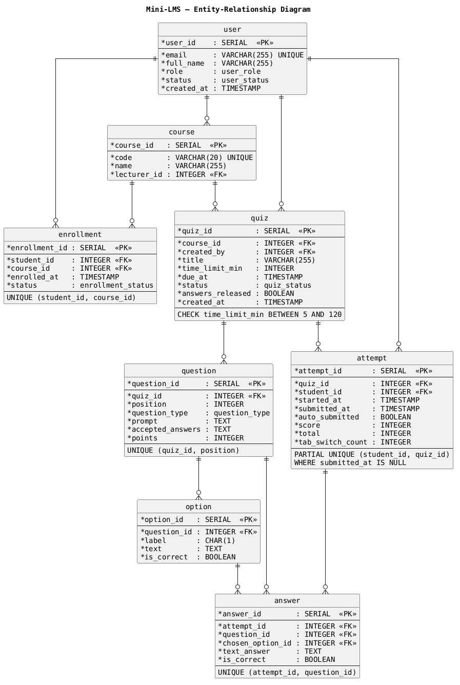

# Milestone 2 — Design Document


## 1. Architecture


## 2. Data model



**The ERD in brief (full attributes in the image):**

```text
  user ──1:N──▶ course (as lecturer_id)
  user ──1:N──▶ enrollment ◀──N:1── course
  course ──1:N──▶ quiz
  user ──1:N──▶ quiz (as created_by)
  quiz ──1:N──▶ question ──1:N──▶ option
  quiz ──1:N──▶ attempt ──1:N──▶ answer ──N:1── question
  user ──1:N──▶ attempt (as student_id)
```

| Table | Purpose | Columns | Constraint · M1 rule |
|---|---|---|---|
| **user** | Every person who can sign in. | `user_id` PK · `email` UNIQUE NOT NULL · `full_name` · `role` ENUM(Student, Lecturer, Admin) · `status` ENUM(Active, Disabled) · `created_at` | `email` UNIQUE → identity key from SSO (**BR7**). `status='Disabled'` blocks login (**US06**). |
| **course** | A taught unit that quizzes belong to. | `course_id` PK · `code` UNIQUE · `name` · `lecturer_id` FK → user NOT NULL | `lecturer_id NOT NULL` → exactly one lecturer per course (**BR9**). |
| **enrollment** | M:N link between students and courses. | `enrollment_id` PK · `student_id` FK · `course_id` FK · `enrolled_at` · `status` ENUM(Active, Removed) · **UNIQUE(student_id, course_id)** | UNIQUE prevents double enrolment (**US12**). Only `Active` rows count for quiz visibility (**BR6**). |
| **quiz** | A quiz inside a course. | `quiz_id` PK · `course_id` FK · `created_by` FK · `title` · `time_limit_min` INT · `due_at` TIMESTAMP · `status` ENUM(Draft, Published, Unpublished) · `answers_released` BOOL · `created_at` | `CHECK (time_limit_min BETWEEN 5 AND 120)` (**BR2**). `status='Published'` gates visibility (**BR6**). `answers_released` gates **US10**. |
| **question** | One question in a quiz. | `question_id` PK · `quiz_id` FK · `position` INT · `question_type` ENUM(MCQ, SHORT) · `prompt` TEXT · `accepted_answers` TEXT (JSON, for SHORT) · `points` INT DEFAULT 1 · **UNIQUE(quiz_id, position)** | `points = 1` (**BR4**). |
| **option** | One selectable choice for an MCQ. | `option_id` PK · `question_id` FK · `label` CHAR(1) · `text` · `is_correct` BOOL | Exactly one `is_correct=TRUE` per MCQ (**BR4**). |

---

## 3. API design

### Auth / session

| Method | Path | Input | Success | Errors |
|---|---|---|---|---|
| GET | `/login` | — | `302` redirect to university SSO | — |
| GET | `/api/auth/sso/callback` | `code` / SSO assertion | `200` `{user_id, email, full_name, role}` + session cookie | `401` invalid SSO assertion <br/> `403` `"Account is disabled"` (US06) |
| GET | `/api/me` | — | `200` current user `{user_id, email, full_name, role}` | `401` not signed in |

### Student — P0

| Method | Path | Input | Success | Errors |
|---|---|---|---|---|
| GET | `/api/quizzes` | — | `200` `{count, quizzes:[{quiz_id,title,course_code,due_at,time_limit_min}]}` visible per BR6 | `401` unauth <br/> `403` not Student <br/> `503` DB down |
| POST | `/api/quizzes/{quizId}/attempts` | — | `200` active attempt `{attempt_id, quiz_id, started_at, remaining_seconds, questions?}` — resumes existing active attempt instead of creating a second one (BR1) | `401` unauth <br/> `403` not enrolled / not Student <br/> `404` quiz not found <br/> `422` quiz not `Published` or due date passed (BR6) |
| GET | `/api/attempts/{attemptId}` | — | `200` attempt state `{attempt_id, remaining_seconds, questions:[...], saved_answers, tab_switch_count}` | `401` unauth <br/> `403` not attempt owner <br/> `404` attempt not found |
| PUT | `/api/attempts/{attemptId}/answers/{questionId}` | `chosen_option_id` or `text_answer` | `200` saved answer | `401` unauth <br/> `403` not attempt owner <br/> `404` attempt/question not found <br/> `409` attempt already submitted <br/> `422` option/question type mismatch |
| POST | `/api/attempts/{attemptId}/tab-switch` | — | `200` `{tab_switch_count}` — used for BR10 flagging | `401` unauth <br/> `403` not attempt owner <br/> `404` attempt not found <br/> `409` attempt already submitted |
| POST | `/api/attempts/{attemptId}/submit` | `{auto_submitted?: boolean}` | `200` `{attempt_id, score, total, percentage:"80.00%", auto_submitted}` within 2s (US04, BR3, BR4, BR5). If timer expired, returns `auto_submitted: true` and message `"Time is up."` | `401` unauth <br/> `403` not attempt owner <br/> `404` attempt not found <br/> `409` already submitted |
| GET | `/api/attempts/{attemptId}/result` | — | `200` `{score,total,percentage,answers_released, questions?}` — per-question detail only if answers released (US10) | `401` unauth <br/> `403` not attempt owner <br/> `404` attempt not found <br/> `409` attempt not submitted |
| GET | `/api/results` | — | `200` past attempts list with quiz title, date, score, percentage | `401` unauth <br/> `403` not Student |

### Lecturer — P0

| Method | Path | Input | Success | Errors |
|---|---|---|---|---|
| POST | `/api/instructor/quizzes` | `course_id, title, time_limit_min, due_at` | `201` `{quiz_id, status:"Draft", ...}` (US01) | `401` unauth <br/> `403` not Lecturer / not owner of course (BR8) <br/> `404` course not found <br/> `422` `"Title is required"` / `time_limit_min` outside 5–120 (BR2) / invalid `due_at` |
| PUT | `/api/instructor/quizzes/{quizId}` | `title, time_limit_min, due_at` | `200` updated quiz | `401` unauth <br/> `403` not owner <br/> `404` quiz not found <br/> `422` validation error |
| POST | `/api/instructor/quizzes/{quizId}/questions` | `{question_type:"MCQ"\|"SHORT", prompt, options?:[{label,text,is_correct}], accepted_answers?}` | `201` created question (US01) | `401` unauth <br/> `403` not owner <br/> `404` quiz not found <br/> `422` MCQ must have exactly 4 options and exactly 1 correct; SHORT missing accepted answer |
| PUT | `/api/instructor/quizzes/{quizId}/questions/{questionId}` | same as POST question | `200` updated question | `401` unauth <br/> `403` not owner <br/> `404` quiz/question not found <br/> `422` validation error |
| DELETE | `/api/instructor/quizzes/{quizId}/questions/{questionId}` | — | `204` deleted | `401` unauth <br/> `403` not owner <br/> `404` quiz/question not found |
| POST | `/api/instructor/quizzes/{quizId}/publish` | — | `200` `{quiz_id, status:"Published"}` (US05) | `401` unauth <br/> `403` not owner <br/> `404` quiz not found <br/> `422` no questions / due date already passed |
| POST | `/api/instructor/quizzes/{quizId}/unpublish` | — | `200` `{quiz_id, status:"Unpublished"}`, existing attempts preserved (US05) | `401` unauth <br/> `403` not owner <br/> `404` quiz not found |
| GET | `/api/instructor/quizzes` | — | `200` lecturer’s quiz list | `401` unauth <br/> `403` not Lecturer |
| GET | `/api/instructor/quizzes/{quizId}/students` | — | `200` roster with attempted/not attempted, score, and `flagged` if `tab_switch_count > 3` (BR10) | `401` unauth <br/> `403` not owner <br/> `404` quiz not found |
| GET | `/api/instructor/stats/{quizId}` | — | `200` average, distribution, per-question difficulty | `401` unauth <br/> `403` not owner <br/> `404` quiz not found |

### Admin — P0

| Method | Path | Input | Success | Errors |
|---|---|---|---|---|
| POST | `/api/admin/accounts` | `email, full_name, role` | `201` created account (US06) | `401` unauth <br/> `403` not Admin <br/> `409` email already exists <br/> `422` invalid role |
| PATCH | `/api/admin/accounts/{userId}/status` | `{status:"Active"\|"Disabled"}` | `200` updated account | `401` unauth <br/> `403` not Admin <br/> `404` user not found <br/> `422` invalid status |
| GET | `/api/admin/accounts` | `role?, status?` | `200` account list | `401` unauth <br/> `403` not Admin |
| POST | `/api/admin/courses` | `code, name, lecturer_email` | `201` created course (US11) | `401` unauth <br/> `403` not Admin <br/> `409` course code already exists <br/> `422` lecturer not found or not Lecturer |
| PATCH | `/api/admin/courses/{courseId}/lecturer` | `{lecturer_email: string \| null}` | `200` updated course | `401` unauth <br/> `403` not Admin <br/> `404` course not found <br/> `409` `"Assign another lecturer first"` when removing without replacement (BR9) <br/> `422` lecturer invalid/not Lecturer |
| GET | `/api/admin/courses` | — | `200` course list | `401` unauth <br/> `403` not Admin |
| POST | `/api/admin/courses/{courseId}/enrollments` | `{student_email}` | `201` enrollment created (US12) | `401` unauth <br/> `403` not Admin <br/> `404` course/student not found <br/> `409` already enrolled <br/> `422` user is not Student |
| DELETE | `/api/admin/courses/{courseId}/enrollments/{studentId}` | — | `204` removed | `401` unauth <br/> `403` not Admin <br/> `404` enrollment not found |
| GET | `/api/admin/courses/{courseId}/students` | — | `200` course roster | `401` unauth <br/> `403` not Admin <br/> `404` course not found |

### P0 coverage check

| P0 story | Endpoints |
|---|---|
| US01 Lecturer creates quiz | `POST /api/instructor/quizzes`, `POST /api/instructor/quizzes/{quizId}/questions` |
| US02 Student sees available quizzes | `GET /api/quizzes` |
| US03 Student takes quiz with timer | `POST /api/quizzes/{quizId}/attempts`, `GET /api/attempts/{attemptId}`, `PUT /api/attempts/{attemptId}/answers/{questionId}`, `POST /api/attempts/{attemptId}/submit` |
| US04 Automatic grading + immediate score | `POST /api/attempts/{attemptId}/submit`, `GET /api/attempts/{attemptId}/result` |
| US05 Lecturer publishes / unpublishes | `POST /api/instructor/quizzes/{quizId}/publish`, `POST /api/instructor/quizzes/{quizId}/unpublish` |
| US06 Admin manages accounts | `POST /api/admin/accounts`, `PATCH /api/admin/accounts/{userId}/status`, `GET /api/auth/sso/callback` |
| US11 Admin creates courses + assigns lecturer | `POST /api/admin/courses`, `PATCH /api/admin/courses/{courseId}/lecturer` |
| US12 Admin enrolls students | `POST /api/admin/courses/{courseId}/enrollments`, `DELETE /api/admin/courses/{courseId}/enrollments/{studentId}` |


## 4. Walking skeleton


## 5. Design decisions


## 6. What changed since M1

## 6. What Changed Since M1

Four changes, ordered by how much they reshaped the document.

1. **Added the Admin role (US06, US11, US12 at P0).** M1 had lecturers managing their own accounts and courses. The reviewer made it clear this overloaded the lecturer's job. Ownership moved to a dedicated administrative role whose scope is roster maintenance only. **BR8** was rewritten to separate *manage* (Admin, write) from *monitor* (Lecturer, read).

2. **Added BR10 — tab-switch cheating signal.** M1 did not model anti-cheating at all. **BR10** now records every tab-switch event on the `attempt` table; more than 3 events in one attempt flags the row, and the flag is visible only to the lecturer in the roster view. No new user story — the flag surfaces inside the existing lecturer monitoring screen.

3. **Added BR7 — authentication delegated to university SSO.** M1's diagrams showed `University SSO` as an actor, but no rule explained what it did. **BR7** closes that gap: Mini-LMS never stores passwords; only the SSO-returned email and the local role are kept.

4. **Added US12 (Admin enrols students) and promoted it to P0.** M1 assumed students self-enrolled or were enrolled by the lecturer. Both were wrong for a course-scoped system. Enrolment is now a first-class admin action, mapped to `POST /api/admin/courses/{id}/students`.
