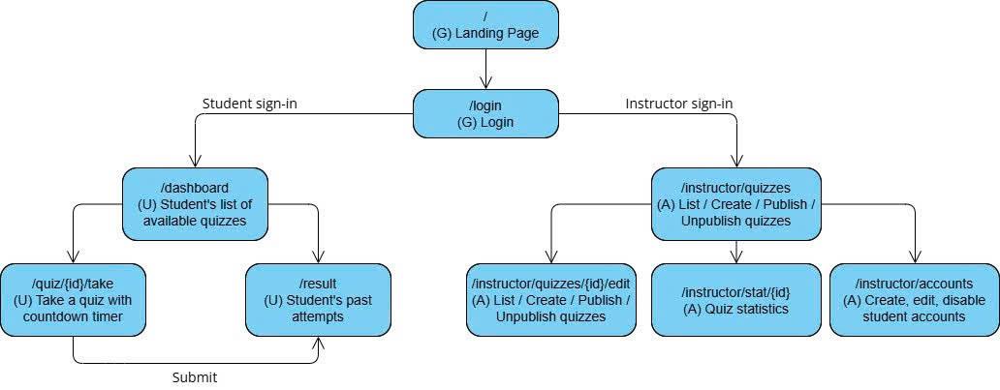

# Requirements Document

## 1. Product vision

For students and lecturers at a Vietnamese university who today rely on paper quizzes or spreadsheet-based manual grading, **Mini-LMS** removes the multi-day grading bottleneck and the absence of immediate, per-question feedback by providing a lightweight web platform for quiz authoring, timed delivery, automatic grading, and class-level analytics — unlike generic LMS suites, it is scoped to a single course workflow so it can be deployed and understood within minutes.

## 2. Personas

### Persona 1 — Ha Duc Minh, the student

- **Role:** 20-year-old second-year undergraduate at a Vietnamese university, taking 4 courses this semester.
- **Goal:** keep track of upcoming quizzes in one place, and get his score immediately after submitting so he knows whether he is ready for the final exam.
- **What blocks him:** quizzes are announced verbally in class or scattered across group chats with no central list; results come back days or weeks later after manual grading; he cannot see which topics he is weak on.
- **In his words:** *"I just want to know my score now, not next week."*
- **Technical skill:** comfortable with both phone and laptop; uses the university portal, Google Classroom, and Zalo daily.
- **Interview note:** interviewed on 10-09-2026 for 30 minutes, in person.

### Persona 2 — Dr. Pham Thi Lan, the lecturer

- **Role:** 45-year-old lecturer at a Vietnamese university, teaching 3 courses with roughly 120 students in total.
- **Goal:** assess students frequently without spending hours grading, and identify which topics the class is struggling with.
- **What blocks her:** grading MCQ and short-answer quizzes by hand in Excel takes 4–6 hours per quiz; she has no reliable way to see per-question difficulty.
- **In her words:** *"I stopped giving weekly quizzes because grading them ate my weekends."*
- **Technical skill:** confident with Excel and the university's existing LMS; not a programmer.
- **Interview note:** interviewed on 12-09-2026 for 25 minutes, online call.

## 3. Scenarios

### Scenario 1 — Dr. Lan prepares and reviews a weekly quiz

1. On Monday evening Dr. Lan decides to assess her *Introduction to Accouting* class on the week's material.
2. She opens the platform on her laptop and signs in with her university email.
3. She creates a new quiz, sets a title, a 30-minute time limit, and a due date of Friday 23:59.
4. She adds 10 questions — 7 multiple-choice and 3 short-answer — each with a correct answer.
5. She saves the quiz as a draft and reads through it once more.
6. She publishes the quiz, and it becomes visible to all 120 students in the class.
7. On Friday night she checks the class statistics and sees that Question 4 was answered correctly by only 25% of students.
8. The following Monday she spends 10 minutes reviewing Question 4 in class instead of spending the weekend grading.

### Scenario 2 — Minh takes a quiz and reviews his result

1. On Thursday evening Minh is in his dormitory and remembers a quiz is due Friday night.
2. He opens the platform on his laptop and signs in with his student email.
3. He sees the quiz listed with a 30-minute limit and the Friday due date.
4. He starts the quiz and answers the multiple-choice and short-answer questions one at a time.
5. Halfway through, his phone rings; he briefly switches tabs but returns within the time limit.
6. At 28 minutes he submits; the timer still shows 02:00.
7. He immediately sees his raw score and percentage.
8. Two days later, after Dr. Lan releases the answers, he reviews exactly which questions he got wrong.

## 4. User stories

**Summary table**

| ID | Story | Priority | Points |
|---|---|---|---|
| US01 | Lecturer creates a quiz (MCQ + short answer) | P0 | 8 |
| US02 | Student sees available quizzes | P0 | 3 |
| US03 | Student takes a quiz with countdown timer | P0 | 5 |
| US04 | Automatic grading + immediate score | P0 | 5 |
| US05 | Student views past attempts | P1 | 3 |
| US06 | Lecturer publishes / unpublishes a quiz | P1 | 3 |
| US07 | Lecturer sees class statistics | P1 | 5 |
| US08 | Lecturer sees per-question difficulty | P1 | 5 |
| US09 | Lecturer manages student accounts | P1 | 5 |
| US10 | Student reviews answers after release | P2 | 3 |

### US01 — Lecturer creates a quiz · P0 · 8 points · Screen: `/instructor/quizzes/{id}/edit`

> As a **lecturer**, I want to **create a quiz with multiple-choice and short-answer questions** so that **I can assess my class online**.

**Acceptance criteria**
- Given the lecturer enters the title `"Midterm Quiz"`, a time limit of `"30 minutes"`, and a due date of `"2026-10-10 23:59"`, When the lecturer saves, Then the quiz is created with status `Draft`.
- Given the lecturer adds a question `"What is 2+2?"` with options `3, 4, 5, 6` and marks `4` as correct, When the lecturer saves, Then the question appears with exactly **4** options and exactly **1** marked correct.
- Given the title field is empty, When the lecturer saves, Then the system shows `"Title is required"` and the quiz is not saved.

**Tasks**
- Quiz form UI (title, time limit, due date) — @Altimary
- Question editor for MCQ + short-answer — @BuiDut
- Persist quiz, questions, and accepted answers — @thangkaka26
- Validation tests (empty title, no correct option, out-of-range limit) — @VizAnh

---

### US02 — Student sees available quizzes · P0 · 3 points · Screen: `/dashboard`

> As a **student**, I want to **see the quizzes available to me with their due dates and time limits** so that **I know what to take and by when**.

**Acceptance criteria**
- Given **3** published quizzes are assigned to Minh's class, When Minh opens his dashboard, Then all **3** quizzes appear with title, due date, and time limit.
- Given quiz `"Midterm Quiz"` is due on `"2026-10-10 23:59"` and has a **30-minute** limit, When the list is shown, Then the row displays exactly `"2026-10-10 23:59"` and `"30 min"`.
- Given a quiz is still in `Draft` status, When Minh opens his dashboard, Then that quiz does not appear in the list.

**Tasks**
- Availability query (Published + before due date) — @thangkaka26
- Dashboard quiz list UI — @Altimary
- Visibility tests (draft hidden, due-date edge cases) — @VizAnh

---

### US03 — Student takes a quiz with countdown timer · P0 · 5 points · Screen: `/quiz/{id}/take`

> As a **student**, I want to **take a quiz with a visible countdown timer** so that **I can manage my time and submit within the limit**.

**Acceptance criteria**
- Given a quiz has **10** questions and a **30-minute** limit, When Minh starts the quiz, Then the timer displays `"30:00"` and counts down every second.
- Given the timer reaches `"00:00"`, When time expires, Then the quiz auto-submits and Minh sees `"Time is up."`
- Given Minh has answered **4** of **10** questions, When he clicks Submit, Then the system asks for confirmation before submitting.

**Tasks**
- Quiz-taking UI (one question at a time) — @Altimary
- Countdown timer + auto-submit at `00:00` — @VizAnh
- Per-question answer persistence (resume support) — @thangkaka26
- Timer, auto-submit, and resume tests — @BuiDut

---

### US04 — Automatic grading and immediate score · P0 · 5 points · Screen: `/quiz/{id}/result?attempt={n}` (result view)

> As a **student**, I want **my quiz to be graded automatically the moment I submit** so that **I get my score without waiting**.

**Acceptance criteria**
- Given a quiz has **10** questions and Minh answers **8** correctly, When Minh submits, Then the system shows raw score `"8/10"` and percentage `"80.00%"`.
- Given Minh submits, When grading finishes, Then the result appears within **2 seconds**.
- Given Minh's short-answer is `"  Hà Nội "` with surrounding whitespace, and the accepted answer is `"Hà Nội"`, When grading runs, Then it is marked correct.

**Tasks**
- MCQ grader (exact match against marked option) — @Altimary
- Short-answer normalizer (case-insensitive, whitespace-trimmed) — @BuiDut
- Score + percentage renderer (2 decimal places) — @VizAnh
- Grading unit tests (case, whitespace, wrong answer) — @thangkaka26

---

### US05 — Student views past attempts · P1 · 3 points · Screen: `/results`

> As a **student**, I want to **see my past quiz attempts and scores** so that **I can track my progress over the semester**.

**Acceptance criteria**
- Given Minh has completed **4** quizzes, When he opens `My Results`, Then **4** rows appear with quiz title, date, and score.
- Given Minh scored **8/10** on `"Midterm Quiz"`, When the row is shown, Then it displays `"8/10"` and `"80.00%"`.

**Tasks**
- Attempt history query (grouped by quiz) — @BuiDut
- Results list UI — @Altimary
- Formatting and empty-state tests — @thangkaka26

---

### US06 — Lecturer publishes / unpublishes a quiz · P1 · 3 points · Screen: `/instructor/quizzes`

> As a **lecturer**, I want to **publish or unpublish a quiz** so that **I control exactly when students can access it**.

**Acceptance criteria**
- Given a `Draft` quiz, When Dr. Lan clicks Publish, Then the status changes to `Published` and the quiz appears in Minh's dashboard.
- Given a `Published` quiz with **5** existing student attempts, When Dr. Lan unpublishes it, Then students can no longer start new attempts, but the **5** existing attempts remain accessible.

**Tasks**
- Publish / unpublish endpoint — @thangkaka26
- Status badge and toggle UI — @Altimary
- Tests for the "existing attempts preserved" rule — @BuiDut

---

### US07 — Lecturer sees class statistics · P1 · 5 points · Screen: `/instructor/stats/{quizId}`

> As a **lecturer**, I want to **see class statistics — average score and score distribution** so that **I can judge how the class performed overall**.

**Acceptance criteria**
- Given **20** students submitted `"Midterm Quiz"`, When Dr. Lan opens Statistics, Then the average score is displayed as `"7.25/10"`.
- Given the submitted scores are `5, 6, 7, 8, 9, 10`, When the distribution chart is shown, Then it displays counts for each score value from **0 to 10**.

**Tasks**
- Aggregation query (average, min, max, count) — @BuiDut
- Distribution chart component — @Altimary
- Average-formatting test (2 decimal places) — @VizAnh

---

### US08 — Lecturer sees per-question difficulty · P1 · 5 points · Screen: `/instructor/stats/{quizId}`

> As a **lecturer**, I want to **see per-question difficulty as a percentage of correct answers** so that **I can identify which questions were too hard**.

**Acceptance criteria**
- Given **20** students answered Question 1 and **5** answered correctly, When Dr. Lan opens Difficulty Analysis, Then Question 1 shows `"25.00% correct"`.
- Given a question was answered correctly by **18** of **20** students, When the analysis is displayed, Then it shows `"90.00% correct"`.

**Tasks**
- Per-question correctness aggregation — @thangkaka26
- Difficulty table UI — @Altimary
- Edge-case tests (0 answers, 100% correct) — @BuiDut

---

### US09 — Lecturer manages student accounts · P1 · 5 points · Screen: `/instructor/accounts`

> As a **lecturer**, I want to **create, edit, and disable student accounts** so that **only enrolled students can access my quizzes**.

**Acceptance criteria**
- Given Dr. Lan enters email `"sinhvien01@univ.edu"` with role `Student`, When she saves, Then the account is created with a temporary password and the student can log in.
- Given a student account is `Disabled`, When the student tries to log in, Then the system shows `"Account is disabled"` and denies access.
- Given Dr. Lan edits an account email from `"a@univ.edu"` to `"b@univ.edu"`, When she saves, Then the login credential changes and the old email no longer works.

**Tasks**
- Account CRUD API (create, edit, disable) — @thangkaka26
- Accounts management UI — @Altimary
- Password hashing + disabled-login tests — @BuiDut

---

### US10 — Student reviews answers after release · P2 · 3 points · Screen: `/results`

> As a **student**, I want to **review my answers against the correct answers after the lecturer releases them** so that **I can learn from my mistakes**.

**Acceptance criteria**
- Given Dr. Lan has released answers for `"Midterm Quiz"`, When Minh opens his attempt, Then each question shows his answer, the correct answer, and whether it was correct.
- Given Dr. Lan has **not** released answers, When Minh opens his attempt, Then only the total score is shown and no per-question detail appears.

**Tasks**
- Answer-release flag on quiz — @BuiDut
- Per-question review view — @Altimary
- Access-gating tests (before / after release) — @thangkaka26

## 5. Business rules

| ID | Rule | Worked example |
|---|---|---|
| **BR1** | A student may have at most **1** active (in-progress) attempt per quiz at a time. | Minh started `"Midterm Quiz"` at 19:00. At 19:10 he opens the same quiz in another tab → the system resumes the existing attempt instead of creating a second one. |
| **BR2** | A quiz's time limit must be between **5 minutes** and **120 minutes** inclusive. | `5 min` accepted. `120 min` accepted. `4 min` rejected. `121 min` rejected. |
| **BR3** | A quiz auto-submits when the timer reaches **00:00**. | Minh starts a 30-minute quiz at 19:00. At 19:30 the timer reaches `00:00` → the quiz auto-submits with whatever answers were saved. |
| **BR4** | Each question is worth **1 point**, no partial credit. MCQ is graded by exact match against the marked correct option. Short-answer is graded by case-insensitive, whitespace-trimmed match against one of the lecturer's accepted answers. | A 10-question quiz has max score **10**. MCQ Q1 correct = `"B"`; Minh picks `"B"` → **1** point, picks `"C"` → **0**. Short-answer Q2 accepted = `"Hà Nội"`; Minh writes `"  hà nội "` → **1** point; he writes `"Hanoi"` → **0** points. |
| **BR5** | Score is displayed as raw score out of total **and** percentage rounded to **2 decimal places**. | **8** correct out of **10** → `"8/10"` and `"80.00%"`. **7** correct out of **9** → `"7/9"` and `"77.78%"`. |
| **BR6** | A quiz is visible to a student only when its status is `Published` **and** the current time is before its due date. | Quiz due `2026-10-10 23:59`, status `Published` → visible on `2026-10-10 22:00`. Same quiz on `2026-10-11 00:01` → not visible, cannot be started. |

## 6. Screens and flow

**Access legend:** **G** = Guest (not signed in) · **U** = authenticated student · **A** = authenticated instructor.

| Route | Purpose | Access | Priority |
|-------|---------|--------|----------|
| `/` | Landing page | G | P0 |
| `/login` | Login | G | P0 |
| `/dashboard` | Student's list of available quizzes | U | P0 |
| `/quiz/{id}/take` | Take a quiz with countdown timer | U | P0 |
| `/quiz/{id}/result?attempt={n}` | The result of the attempted quiz | U | P0 |
| `/results` | Student's past attempts | U | P2 |
| `/instructor/quizzes` | Lecturer's quiz list; create, publish, unpublish | A | P1 |
| `/instructor/quizzes/{id}/edit` | Modify a quiz's contents, like questions or timer | A | P0 |
| `/instructor/stats/{id}` | Quiz statistics: average, distribution, per-question difficulty | A | P1 |
| `/instructor/accounts` | Create, edit, and disable student accounts | A | P1 |

### Flow diagram

